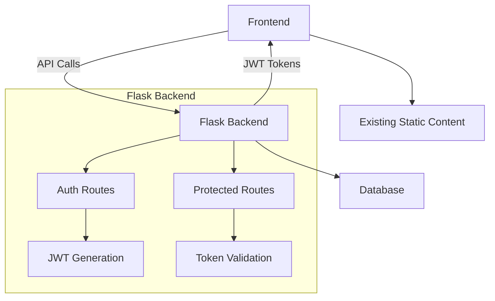

# Flask Backend Implementation Plan

## Overview
Add Flask backend to existing static site to handle:
- User authentication (login/registration)
- Protected content serving
- User account data management

## Architecture


## Implementation Steps

### 1. Backend Setup
- Create `backend/` directory structure
- Install required packages:
  ```bash
  pip install flask flask-cors pyjwt python-dotenv
  ```
- Configure CORS for frontend access
- Set up JWT-based authentication
- Environment configuration (.env file)

### 2. Database
- SQLite for development
- PostgreSQL for production
- User model schema:
  ```python
  class User:
      id: int
      username: str
      email: str
      password_hash: str
      created_at: datetime
  ```
- CRUD operations for user management

### 3. API Endpoints
#### Authentication:
- `POST /api/auth/register` - User registration
- `POST /api/auth/login` - User login
- `POST /api/auth/refresh` - Token refresh
- `POST /api/auth/logout` - Token invalidation

#### Protected Routes:
- `GET /api/user/profile` - Get user profile
- `PUT /api/user/profile` - Update profile
- `GET /api/user/data` - Get protected data

### 4. Frontend Integration
- Modify existing auth flow to use Flask endpoints
- Add token handling:
  - Store JWT in secure cookies
  - Add to Authorization header for API calls
- Update all API calls to use new endpoints
- Handle token expiration/refresh

### 5. Development Workflow
1. Start Flask dev server:
   ```bash
   flask --app backend run --port 5000 --debug
   ```
2. Frontend runs on existing Vite server (port 3000)
3. Proxy API requests in Vite config:
   ```js
   server: {
     proxy: {
       '/api': 'http://localhost:5000'
     }
   }
   ```

### 6. Deployment
- Containerize with Docker
- Nginx reverse proxy configuration
- Production environment variables
- Database migration setup

## Security Considerations
- Password hashing (bcrypt)
- HTTPS enforcement
- CSRF protection
- Rate limiting
- Input validation
- Secure JWT storage